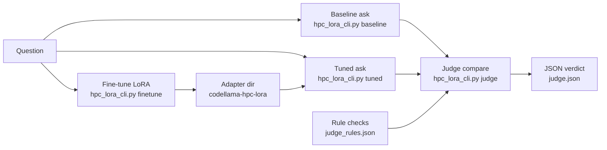

# CodeLlama HPC LoRA Demo

Minimal, reproducible lifecycle demo:
1) Ask baseline model.
2) LoRA/QLoRA fine-tune on a tiny HPC dataset.
3) Ask again with adapter.
4) Judge answers with a second model.

## Usage statement
This repo is an operations-ready demo of a full model-improvement loop for HPC Q&A. It is designed for small, reproducible runs on a laptop (macOS M1) while scaling to GPUs for larger models. The workflow is deterministic (`do_sample=False`) to make baseline vs tuned diffs easy to inspect.

## References
- ChatMPI / ChatHPC paper (ACM Digital Library):
  https://dl.acm.org/doi/10.1145/3773656.3773659
- ORNL ChatHPC application (GitHub):
  https://github.com/ORNL/ChatHPC-app

## Architecture workflow


## Setup
```bash
# macOS: use uv/uvx to install a local Python (example: 3.13.7)
uvx python@3.13.7 -m venv .venv
source .venv/bin/activate
uv pip install -r requirements.txt
```

Notes:
- `bitsandbytes` installs on Linux only (for 4-bit QLoRA). Omit `--use-4bit` on macOS/CPU.
- First run will download models unless already cached.
 - On macOS, MPS is used when available; set `PYTORCH_ENABLE_MPS_FALLBACK=1` if you hit MPS op gaps.

## Linux server setup (no uv/uvx assumption)
```bash
# Use system Python if available
python3 -m venv .venv
source .venv/bin/activate
pip install -r requirements.txt

# Optional: install uv for faster installs
# curl -LsSf https://astral.sh/uv/install.sh | sh
# uv venv .venv
# source .venv/bin/activate
# uv pip install -r requirements.txt
```

## Data
- `data_train.jsonl` / `data_train.json`: training set (HPC/Slurm/Spack).
- `data_eval.jsonl` / `data_eval.json`: held-out prompts for sanity checks.
- `context_default.jsonl` / `context_default.json`: system/context prompt used for chat-style prompts.
- `judge_rules.json`: judge rule configuration with hard/soft tokens (see below).

## High-level CLI (recommended)
```bash
# Baseline: collect the foundation model answer for comparison
python hpc_lora_cli.py baseline --model-id codellama/CodeLlama-7b-Instruct-hf --out baseline.txt

# Fine-tune: train a small LoRA adapter on the HPC dataset
python hpc_lora_cli.py finetune --model-id codellama/CodeLlama-7b-Instruct-hf --output-dir codellama-hpc-lora

# (Optional) Use JSON instead of JSONL
python hpc_lora_cli.py finetune --data-path data_train.json --output-dir codellama-hpc-lora

# Chat-tuned models: train with chat template + context for better inference
python hpc_lora_cli.py finetune --model-id TinyLlama/TinyLlama-1.1B-Chat-v1.0 \
  --output-dir codellama-hpc-lora --use-chat-template --context-path context_default.jsonl

# Adapter inference: ask the same question using the tuned adapter
python hpc_lora_cli.py tuned --adapter-path codellama-hpc-lora --out tuned.txt

# Judge: score baseline vs tuned answers with a second model
python hpc_lora_cli.py judge --judge-model meta-llama/Meta-Llama-3.1-8B-Instruct \
  --answer-a "$(cat baseline.txt)" --answer-b "$(cat tuned.txt)" --out judge.json
Notes:
- Some judge models (e.g., Meta-Llama) are gated on Hugging Face and require `HF_TOKEN` plus network access.
- Use `--local-files-only` if the judge model is already cached locally.
- Add `--rule-check` to apply deterministic HPC format checks (see `judge_rules.json`).

# End-to-end demo: run baseline -> tune -> tuned -> judge in one command
python hpc_lora_cli.py demo --model-id codellama/CodeLlama-7b-Instruct-hf --adapter-path codellama-hpc-lora

# Debug: add --debug to surface model loading/device logs
python hpc_lora_cli.py baseline --debug --out baseline.txt

# Progress: stream model downloads/logs and generated tokens to the console
python hpc_lora_cli.py baseline --progress --out baseline.txt

# Context prompt (ChatHPC-style) from JSON/JSONL
python hpc_lora_cli.py baseline --use-context context_default.jsonl --out baseline.txt

# Show resolved context
python hpc_lora_cli.py baseline --use-context context_default.jsonl --show-context

# Ensure a minimum answer length (prevents early EOS)
python hpc_lora_cli.py baseline --min-new-tokens 128 --max-new-tokens 256 --out baseline.txt

# Chat template (recommended for chat-tuned models like TinyLlama)
python hpc_lora_cli.py baseline --use-chat-template --out baseline.txt

# If tuned output is empty, disable eos stopping
python hpc_lora_cli.py tuned --adapter-path codellama-hpc-lora --no-eos --out tuned.txt

# If tuned output is still empty, suppress special tokens (eos/pad)
python hpc_lora_cli.py tuned --adapter-path codellama-hpc-lora --suppress-special --out tuned.txt

# If generation stalls on MPS, try CPU + heartbeat + max-time
python hpc_lora_cli.py baseline --device cpu --heartbeat 10 --max-time 120 --out baseline.txt
```

## Configuration file definitions
- `context_default.jsonl` / `context_default.json`
  - Schema: `{ "context": "<system prompt string>" }`
  - Used by `--use-context` (inference) and `--context-path` (training) to set the system prompt.
- `judge_rules.json`
  - Schema:
    ```json
    {
      "rules": [
        {
          "name": "rule_name",
          "question_contains": "substring match for question",
          "tokens": ["@must_have", "~nice_to_have"]
        }
      ]
    }
    ```

## Judge rule “siduals”
The judge rule tokens use sidual prefixes to mark priority:
- `@token` = hard requirement (must appear in the answer)
- `~token` = soft preference (nice to have)

Hard misses reduce scores and are added to `issues_*`. Soft misses are only reported in `issues_*`.

Example `judge_rules.json`:
```json
{
  "rules": [
    {
      "name": "slurm_interactive_basic",
      "question_contains": "srun command to start an interactive session",
      "tokens": [
        "@srun",
        "@--pty",
        "@bash",
        "@-t",
        "@-c",
        "@--mem",
        "@16g",
        "~-p",
        "~-a",
        "~<partition>",
        "~<account>"
      ]
    }
  ]
}
```

## macOS M1 Pro quickstart (TinyLlama, chat-template)
```bash
# 1) Baseline (M1-verified settings)
python hpc_lora_cli.py baseline \
  --model-id TinyLlama/TinyLlama-1.1B-Chat-v1.0 \
  --use-chat-template --use-context context_default.jsonl \
  --min-new-tokens 128 --max-new-tokens 256 \
  --progress --debug --out baseline.txt

# 2) Fine-tune (chat-template + context)
python hpc_lora_cli.py finetune \
  --model-id TinyLlama/TinyLlama-1.1B-Chat-v1.0 \
  --output-dir codellama-hpc-lora \
  --use-chat-template --context-path context_default.jsonl

# 3) Tuned inference (same chat-template + context)
python hpc_lora_cli.py tuned \
  --adapter-path codellama-hpc-lora \
  --use-chat-template --use-context context_default.jsonl \
  --min-new-tokens 128 --max-new-tokens 256 \
  --out tuned.txt

# 4) Judge (local cached model path + rule checks)
python hpc_lora_cli.py judge \
  --judge-model /Users/sparksjo/.cache/huggingface/hub/models--microsoft--phi-3-mini-4k-instruct/snapshots/0a67737cc96d2554230f90338b163bc6380a2a85 \
  --local-files-only --use-chat-template --no-eos \
  --rule-check --rules-path judge_rules.json \
  --answer-a "$(cat baseline.txt)" --answer-b "$(cat tuned.txt)" --out judge.json
```
Notes:
- Update the judge snapshot path if your cache hash differs:
  `ls /Users/sparksjo/.cache/huggingface/hub/models--microsoft--phi-3-mini-4k-instruct/snapshots`
- Rule checks are question-specific and configured in `judge_rules.json` using `@` (must) and `~` (nice to have).

## Held-out checks (5–10 prompts)
```bash
python ask.py codellama/CodeLlama-7b-Instruct-hf "$(jq -r .instruction data_eval.jsonl | head -n 1)"
python ask_lora.py codellama-hpc-lora "$(jq -r .instruction data_eval.jsonl | head -n 1)"
```

## Notes on hardware
- CPU-only works but will be slow for 7B models.
- macOS (M1 Pro): uses MPS (float16). QLoRA 4-bit is not available on macOS.
- If VRAM is limited on Linux CUDA, use `--use-4bit` and a smaller `--max-seq-length`.
- Keep `do_sample=False` in scripts to make results deterministic.

## Recommended scenarios (by hardware)

### 1) macOS M1 Pro (fastest to access, slowest per token)
Use a smaller model for responsiveness; keep the full 7B for overnight runs.
```bash
# Small/fast demo model
python hpc_lora_cli.py baseline --model-id TinyLlama/TinyLlama-1.1B-Chat-v1.0 --max-new-tokens 64 --out baseline.txt
python hpc_lora_cli.py finetune --model-id TinyLlama/TinyLlama-1.1B-Chat-v1.0 --output-dir lora-tiny
python hpc_lora_cli.py tuned --adapter-path lora-tiny --max-new-tokens 64 --out tuned.txt

# M1 verified baseline settings (longer but complete answers)
python hpc_lora_cli.py baseline --min-new-tokens 128 --max-new-tokens 256 --out baseline.txt \
  --progress --debug --model-id TinyLlama/TinyLlama-1.1B-Chat-v1.0
```

### 2) Single A100 (good balance, 7B or 13B)
```bash
# 7B baseline + QLoRA
python hpc_lora_cli.py baseline --model-id codellama/CodeLlama-7b-Instruct-hf --max-new-tokens 128 --out baseline.txt
python hpc_lora_cli.py finetune --model-id codellama/CodeLlama-7b-Instruct-hf --use-4bit --output-dir codellama-hpc-lora
python hpc_lora_cli.py tuned --adapter-path codellama-hpc-lora --max-new-tokens 128 --out tuned.txt
```

### 3) 4× H100 (large models, faster fine-tune)
```bash
# 13B baseline + QLoRA (or full fp16)
python hpc_lora_cli.py baseline --model-id codellama/CodeLlama-13b-Instruct-hf --max-new-tokens 256 --out baseline.txt
python hpc_lora_cli.py finetune --model-id codellama/CodeLlama-13b-Instruct-hf --use-4bit --output-dir codellama-hpc-lora-13b
python hpc_lora_cli.py tuned --adapter-path codellama-hpc-lora-13b --max-new-tokens 256 --out tuned.txt
```

Notes:
- Replace model ids with local paths if you already have them cached.
- On macOS, set `PYTORCH_ENABLE_MPS_FALLBACK=1` if you hit MPS op gaps.
